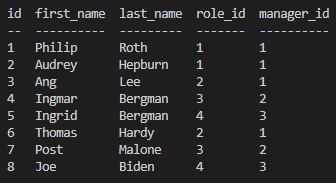
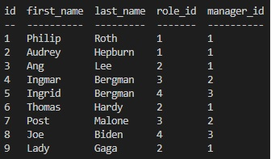
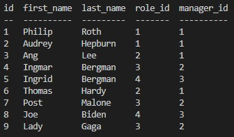
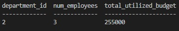

# employee-tracker

## https://drive.google.com/file/d/1BxXWgkpgagZFGTS8Ze1vS0Tx0YEcxhOh/view

The employee tracker allows users to view and manipulate data about employees, roles, and departments. There are 14 prompts and after completing any given prompt, the app will loop back to the prompt menu. The prompts fall into the categories of viewing tables, adding rows, deleting rows, and updating rows.

The SQL statements used in functions range from simple (`"SELECT \* FROM department"`) to complex (`"SELECT department.id AS department_id, COUNT(employee.id) AS num_employees, SUM(salary) AS total_utilized_budget FROM employee JOIN role ON employee.role_id = role.id JOIN department ON role.department_id = department.id WHERE department.id = ${id} GROUP BY department.id"`).

The following screenshots demonstrate the output of one possible chain of actions: viewing all employees, adding a new employee, updating the new employee's role, updating the new employee's manager (currently, updating an employee's role does not automatically update their manager), and then viewing the total budget of the corresponding department.

### View all employees:

### Add a new employee:

### After updating the role and manager of the new employee:

### The total utilized budget of department 2 (corresponding to the employee's new manager_id of 2):

